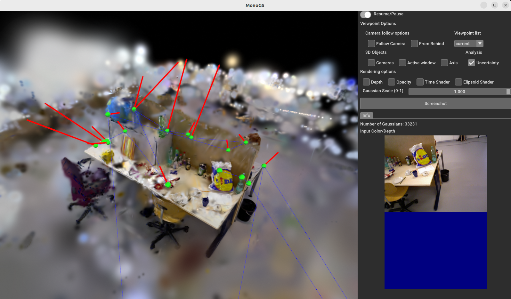

[comment]: <> (# Gaussian Splatting SLAM)

<!-- PROJECT LOGO -->

<p align="center">

  <h1 align="center"> Gaussian Splatting SLAM with Uncertainty Estimation and Guidance
  </h1>
  <p align="center">
    <a href="https://muskie82.github.io/"><strong>*Hidenobu Matsuki</strong></a>
    ·
    <a href="https://rmurai.co.uk/"><strong>*Riku Murai</strong></a>
    ·
    <a href="https://www.imperial.ac.uk/people/p.kelly/"><strong>Paul H.J. Kelly</strong></a>
    ·
    <a href="https://www.doc.ic.ac.uk/~ajd/"><strong>Andrew J. Davison</strong></a>
  </p>
  <p align="center">(* Equal Contribution)</p>

  <h3 align="center"> CVPR 2024 (Highlight)</h3>


[comment]: <> (  <h2 align="center">PAPER</h2>)
  <h3 align="center"><a href="https://arxiv.org/abs/2312.06741">Paper</a> | <a href="https://youtu.be/x604ghp9R_Q?si=nYoWr8h2Xh-6L_KN">Video</a> | <a href="https://rmurai.co.uk/projects/GaussianSplattingSLAM/">Project Page</a></h3>
  <div align="center"></div>

<p align="center">
  <a href="">
    
  </a>
  <a href="">
    
  </a>
</p>
<p align="center">
This software implements dense SLAM system presented in our paper <a href="https://arxiv.org/abs/2312.06741">Gaussian Splatting SLAM</a> in CVPR'24.
The method demonstrates the first monocular SLAM solely based on 3D Gaussian Splatting (left), which also supports Stereo/RGB-D inputs (middle/right).
</p>
<br>

# Note
- In an academic paper, please refer to our work as **Gaussian Splatting SLAM** or **MonoGS** for short (this repo's name) to avoid confusion with other works.
- Differential Gaussian Rasteriser with camera pose gradient computation is available [here](https://github.com/rmurai0610/diff-gaussian-rasterization-w-pose.git).
- **[New]** Speed-up version of our code is available in `dev.speedup` branch, It achieves up to 10fps on monocular fr3/office sequence while keeping consistent performance (tested on RTX4090/i9-12900K). The code will be merged into the main branch after further refactoring and testing.

# Changes
- This fork adds Fisher-information-based uncertainty estimation on top of MonoGS. All datasets, system/environment requirements, and training commands are compatible with the original repo.
- Using this uncertainty estimation, the program calculates the highest error gaussian that contibutes to a viewpoint and represents this in the 3D viewer with a sphere and an accompanying vector in the direction of capture which is scaled to the size of the error. 
- After exploring the scene, the user will have gathered a set of errors along with their origins and uncertainty, which can then be used to guide refinement and additional data capture
- Refer to the **Run** section and the sub heading **Uncertainty Settings** which provides instructions on how to use this feature

# Getting Started
## Installation
```
git clone https://github.com/muskie82/MonoGS.git --recursive
cd MonoGS
```
Setup the environment.

```
conda env create -f environment.yml
conda activate MonoGS
```
Depending on your setup, please change the dependency version of pytorch/cudatoolkit in `environment.yml` by following [this document](https://pytorch.org/get-started/previous-versions/).

Our test setup were:
- Ubuntu 20.04: `pytorch==1.12.1 torchvision==0.13.1 torchaudio==0.12.1 cudatoolkit=11.6`
- Ubuntu 18.04: `pytorch==1.12.1 torchvision==0.13.1 torchaudio==0.12.1 cudatoolkit=11.3`

## Quick Demo
```
bash scripts/download_tum.sh
python slam.py --config configs/mono/tum/fr3_office.yaml
```
You will see a GUI window pops up.

## Downloading Datasets
Running the following scripts will automatically download datasets to the `./datasets` folder.
### TUM-RGBD dataset
```bash
bash scripts/download_tum.sh
```

### Replica dataset
```bash
bash scripts/download_replica.sh
```

### EuRoC MAV dataset
```bash
bash scripts/download_euroc.sh
```


## Run
### Monocular
```bash
python slam.py --config configs/mono/tum/fr3_office.yaml
```

### RGB-D
```bash
python slam.py --config configs/rgbd/tum/fr3_office.yaml
```

```bash
python slam.py --config configs/rgbd/replica/office0.yaml
```
Or the single process version as
```bash
python slam.py --config configs/rgbd/replica/office0_sp.yaml
```


### Stereo (experimental)
```bash
python slam.py --config configs/stereo/euroc/mh02.yaml
```

### Uncertainty Settings
To turn on the uncertainty calculation, add the argument --uncertainty_mode when running the program which is off by default. Next, in the viewer, select the checkbox **Uncertainty** to see visualisations

```bash
python slam.py --config {.yaml path} --uncertainty_mode
```

Following this, there are 4 other settings (use --help for more assistance). All are run in the format
```bash
python slam.py --config {.yaml path} --uncertainty_mode --patch_size <int> --top_k <int> --keyframes_per_calculation <int> --itr_per_avg <int> 
```
`--path_size` Size (in pixels) of the square patches used for first-pass variance scanning. Smaller = finer localisation but slower; larger = coarser but faster
Uncertainty and Render images are automatically saved to a file called experiments. Default = 8

`--top_k` After the fast scan, only the top-k most variant patches enter the expensive Fisher back-prop step. Reducing `top_k` speeds up rendering but may miss rare artefacts; increasing gives more accurate maps at the cost of GPU time. Default = 16000

`--keyframes_per_calculation` The number of keyframes that pass before calling the uncertainty logic. This can be run every keyframe but performance is impacted. When uncertainty is run, a red sphere will be placed in the scene at the current worst gaussian's position and reset upon the next call. Default = 3

`--itr_per_avg` The number of uncertainty iterations that take place before averaging the worst gaussians. After every `itr_per_avg` iterations, the system computes an average of the last `itr_per_avg` worst gaussians and visualises them as a single permanent green sphere with a red vector in the direction of capture, scaled via the uncertainty. This averaging resets each cycle (sphere remains) and helps to guide additional data capture after a sparse initial scene pass. Default = 3

Example input:
```bash
python slam.py --config {.yaml path} --uncertainty_mode --patch_size 4 --top_k 30000 --keyframes_per_calculation 2 --itr_per_avg 3 
```

<p align="center">
  <a href="">
    
  </a>
</p>
The above image highlights what a program with the uncertainty calculation would look like. Green spheres = averaged worst gaussian across `itr_per_avg` number of uncertainty calculations. The red lines indicate the severity of the uncertainty and which direction it comes from. After an initial pass, the user has a clear idea of where more data needs to be collected and from which viewpoint/orientation.

## Live demo with Realsense
First, you'll need to install `pyrealsense2`.
Inside the conda environment, run:
```bash
pip install pyrealsense2
```
Connect the realsense camera to the PC on a **USB-3** port and then run:
```bash
python slam.py --config configs/live/realsense.yaml
```
We tested the method with [Intel Realsense d455](https://www.mouser.co.uk/new/intel/intel-realsense-depth-camera-d455/). We recommend using a similar global shutter camera for robust camera tracking. Please avoid aggressive camera motion, especially before the initial BA is performed. Check out [the first 15 seconds of our YouTube video](https://youtu.be/x604ghp9R_Q?si=S21HgeVTVfNe0BVL) to see how you should move the camera for initialisation. We recommend to use the code in `dev.speed-up` branch for live demo.

<p align="center">
  <a href="">
    
  </a>
</p>

# Evaluation
<!-- To evaluate the method, please run the SLAM system with `save_results=True` in the base config file. This setting automatically outputs evaluation metrics in wandb and exports log files locally in save_dir. For benchmarking purposes, it is recommended to disable the GUI by setting `use_gui=False` in order to maximise GPU utilisation. For evaluating rendering quality, please set the `eval_rendering=True` flag in the configuration file. -->
To evaluate our method, please add `--eval` to the command line argument:
```bash
python slam.py --config configs/mono/tum/fr3_office.yaml --eval
```
This flag will automatically run our system in a headless mode, and log the results including the rendering metrics.

# Reproducibility
There might be minor differences between the released version and the results in the paper. Please bear in mind that multi-process performance has some randomness due to GPU utilisation.
We run all our experiments on an RTX 4090, and the performance may differ when running with a different GPU.

# Acknowledgement
This work incorporates many open-source codes. We extend our gratitude to the authors of the software.
- [3D Gaussian Splatting](https://github.com/graphdeco-inria/gaussian-splatting)
- [Differential Gaussian Rasterization
](https://github.com/graphdeco-inria/diff-gaussian-rasterization)
- [SIBR_viewers](https://gitlab.inria.fr/sibr/sibr_core)
- [Tiny Gaussian Splatting Viewer](https://github.com/limacv/GaussianSplattingViewer)
- [Open3D](https://github.com/isl-org/Open3D)
- [Point-SLAM](https://github.com/eriksandstroem/Point-SLAM)

# License
MonoGS is released under a **LICENSE.md**. For a list of code dependencies which are not property of the authors of MonoGS, please check **Dependencies.md**.

# Citation
If you found this code/work to be useful in your own research, please considering citing the following:

```bibtex
@inproceedings{Matsuki:Murai:etal:CVPR2024,
  title={{G}aussian {S}platting {SLAM}},
  author={Hidenobu Matsuki and Riku Murai and Paul H. J. Kelly and Andrew J. Davison},
  booktitle={Proceedings of the IEEE/CVF Conference on Computer Vision and Pattern Recognition},
  year={2024}
}

```


